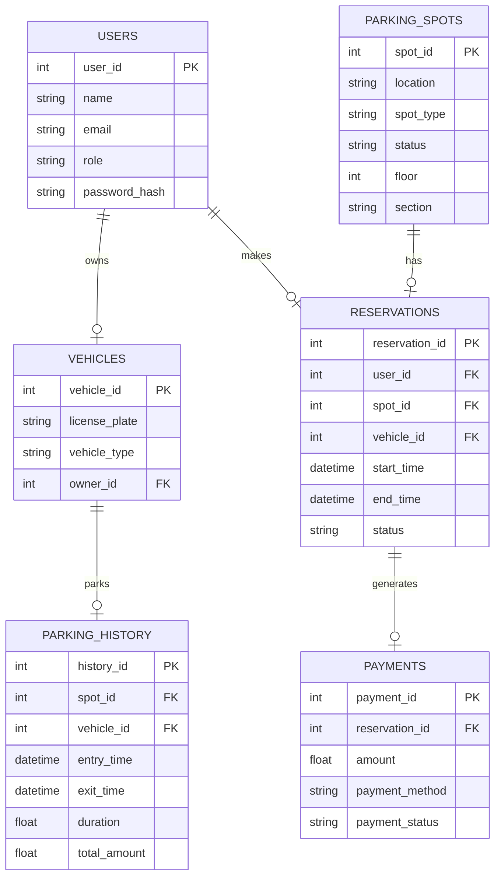

# Designing a Parking Management Software Database: A Comprehensive Guide

In today's urban landscape, efficient parking management has become a critical need due to the increasing number of vehicles and the growing urbanization. With the advent of smart parking solutions, building a software application that handles parking management becomes increasingly important for cities, businesses, and residential areas.

In this blog, we'll walk through how to design a parking management software database. We'll cover:

- The use cases and functional requirements
- High-level system design
- Database schema and entities
- Entity-Relationship Diagram (ERD)
- Key considerations for scalability and performance

Let's dive right in.

---

## **1. Use Cases and Functional Requirements**

Before jumping into database design, we first need to understand the use cases and functional requirements of a parking management system. These use cases define how the system will interact with different users and their needs.

### **Main Actors (Users)**

- **Admin**: The parking lot owner or operator who manages the parking system.
- **Driver**: A person looking for parking or using a parking spot.
- **Parking Attendant**: A staff member who helps manage parking, can handle reservations, and monitor parking availability.

### **Key Use Cases**

1. **Parking Slot Management**: 
   - Admin can add, remove, or modify parking slots.
   - Each parking slot may have attributes such as location (e.g., floor, section), type (e.g., regular, handicapped), and availability status (e.g., occupied, free, reserved).

2. **Vehicle Registration**:
   - Drivers can register their vehicles (license plate, vehicle type, etc.).
   - Admin can view all registered vehicles in the system.

3. **Booking Parking Spot**:
   - Drivers can reserve a parking spot for a specific time.
   - Reservation information includes driver ID, vehicle ID, parking spot ID, reservation start time, and end time.

4. **Payment Management**:
   - Payment methods (credit card, mobile payment) for parking charges.
   - Admin can manage pricing models based on duration, parking spot type, or location.

5. **Parking Monitoring**:
   - Parking attendants can monitor available parking slots in real time.
   - Admin can track parking history and occupancy rates for analysis.

6. **Reporting**:
   - Admin generates reports for usage statistics, revenue, and parking efficiency.

---

## **2. High-Level System Design**

The system will be designed to provide real-time parking availability, reservation management, and financial transactions. A well-structured architecture is needed to ensure scalability and performance. Here's a simplified high-level architecture:

- **Frontend**: A web or mobile application to allow users (drivers, attendants, admins) to interact with the system.
- **Backend**: A RESTful API or GraphQL to handle user requests, manage business logic, and interact with the database.
- **Database**: A relational database (e.g., PostgreSQL, MySQL) to store data about users, parking spots, vehicles, reservations, payments, etc.
- **Third-Party Integrations**: Payment gateways (Stripe, PayPal), map services (Google Maps), etc.
- **Notification System**: For sending alerts to users about parking availability, reservation confirmations, or payment receipts.

**System Components**:
1. **User Management**: Handles user roles, authentication, and authorization.
2. **Parking Management**: Handles parking slots, availability, and reservations.
3. **Payment System**: Integrates with external payment providers and manages billing.
4. **Reporting Module**: Generates statistics and business insights.

---

## **3. Database Schema and Entities**

A parking management system needs to handle several core entities, including users, vehicles, parking spots, reservations, and payments. Let's define the major database entities and their relationships.

### **Core Entities**:

1. **Users**:
   - Stores information about admins, attendants, and drivers.
   - Attributes: `user_id`, `name`, `email`, `role`, `password_hash`.

2. **Vehicles**:
   - Stores information about registered vehicles.
   - Attributes: `vehicle_id`, `license_plate`, `vehicle_type`, `owner_id` (foreign key to Users).

3. **Parking Spots**:
   - Stores details about available parking spots.
   - Attributes: `spot_id`, `location`, `spot_type`, `status` (available, occupied, reserved), `floor`, `section`.

4. **Reservations**:
   - Stores information about parking spot reservations.
   - Attributes: `reservation_id`, `user_id` (foreign key to Users), `spot_id` (foreign key to Parking Spots), `vehicle_id` (foreign key to Vehicles), `start_time`, `end_time`, `status` (active, completed, canceled).

5. **Payments**:
   - Stores payment information.
   - Attributes: `payment_id`, `reservation_id` (foreign key to Reservations), `amount`, `payment_method`, `payment_status`.

6. **Parking History**:
   - Tracks parking history for future analytics and reporting.
   - Attributes: `history_id`, `spot_id`, `vehicle_id`, `entry_time`, `exit_time`, `duration`, `total_amount`.

---

## **4. Entity-Relationship Diagram (ERD)**

An ERD helps visualize the relationships between entities in the database. Below is a simple ERD for the parking management system:

---

## **5. Key Considerations for Scalability and Performance**
When designing a parking management system, scalability and performance are crucial factors. Here are a few key considerations:

1. ** Indexing**:
- Index frequently queried fields such as spot_id, vehicle_id, and user_id to speed up query performance, especially when dealing with large datasets.
2. **Caching**:
- Use a caching mechanism (e.g., Redis) to store frequently accessed data, such as parking spot availability, to reduce load on the database.
3. **Real-Time Updates**:
- Implement WebSockets or server-sent events (SSE) to push real-time parking availability updates to users.
4. **Load Balancing**:
- To handle high traffic, especially during peak times, use load balancers to distribute requests across multiple instances of your application.
5. **Database Sharding**:
- As your parking system grows, consider sharding your database to partition data based on geographical regions or other business rules.

---
## **Conclusion**
Designing a database for a parking management system requires careful consideration of both the business logic and technical requirements. By following a structured approach with clear use cases, a solid schema design, and attention to scalability, you can ensure that your parking software meets the demands of modern cities and provides a seamless experience for users.

Whether you're building the system from scratch or enhancing an existing solution, this framework provides a solid foundation to handle parking reservations, payments, and real-time monitoring effectively.

## **References**
- [Database Design for Beginners](https://learnsql.com)
- Mermaid.js for ERD Diagrams
- PostgreSQL Indexing Techniques